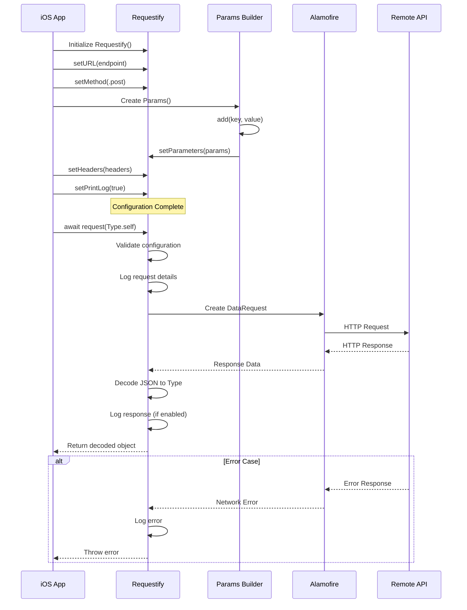

# 🛜 Requestify


`Requestify` is a flexible and reusable network request utility built using Alamofire. It allows developers to easily construct and send HTTP requests with customizable methods, headers, parameters, and logging options.

## 📋 Table of Contents
- [Project Overview](#project-overview)
- [Architecture](#architecture)
- [Features](#features)
- [Installation](#installation)
- [Usage](#usage)
- [Project Structure](#project-structure)
- [CI/CD Pipeline](#cicd-pipeline)
- [Development](#development)
- [Testing](#testing)
- [Contributing](#contributing)

## 🎯 Project Overview

This repository contains:
1. **Requestify Library** - A Swift Package for simplified HTTP networking
2. **RequestifyApp** - A demo iOS application showcasing the library
3. **Automated CI/CD** - GitHub Actions workflow for building, testing, and creating IPAs

### Technical Stack
- **Language**: Swift 5.4+
- **Dependency Manager**: Swift Package Manager
- **Networking**: Alamofire 5.4+
- **Project Generation**: XcodeGen
- **CI/CD**: GitHub Actions
- **Platforms**: iOS 13+, macOS 10.15+, tvOS 12+, watchOS 4+

## 🏗️ Architecture

### System Architecture

```
┌─────────────────────────────────────────────────────────────────┐
│                        GitHub Repository                         │
│                         (poc-ios)                               │
└─────────────────────────────────────────────────────────────────┘
                                │
                    ┌───────────┴───────────┐
                    │                       │
         ┌──────────▼──────────┐  ┌────────▼────────┐
         │   Swift Package     │  │   iOS App       │
         │   (Requestify)      │  │ (RequestifyApp) │
         └──────────┬──────────┘  └────────┬────────┘
                    │                      │
         ┌──────────▼──────────┐          │
         │    Dependencies     │          │
         │    - Alamofire      │◄─────────┘
         └─────────────────────┘

┌─────────────────────────────────────────────────────────────────┐
│                    Component Architecture                        │
├─────────────────────────────────────────────────────────────────┤
│                                                                  │
│  ┌────────────┐      ┌──────────────┐      ┌──────────────┐   │
│  │    App     │──────│  Requestify  │──────│  Alamofire   │   │
│  │   Layer    │      │   Library    │      │   Network    │   │
│  └────────────┘      └──────────────┘      └──────────────┘   │
│        │                     │                      │           │
│        │              ┌──────▼──────┐              │           │
│        │              │   Params    │              │           │
│        │              │   Builder   │              │           │
│        │              └─────────────┘              │           │
│        │                                           │           │
│        └───────────────────────────────────────────┘           │
│                         HTTP/HTTPS                              │
│                            API                                  │
└─────────────────────────────────────────────────────────────────┘
```

### Request Flow Sequence Diagram



### CI/CD Pipeline Architecture

```
┌──────────────────────────────────────────────────────────────────┐
│                    GitHub Actions Workflow                        │
│                      (macOS-latest runner)                       │
└──────────────────────────────────────────────────────────────────┘
                              │
    ┌─────────────────────────┼─────────────────────────┐
    │                         │                         │
┌───▼────┐              ┌─────▼─────┐           ┌──────▼──────┐
│Checkout│              │  Resolve  │           │  XcodeGen   │
│  Code  │              │Dependencies│           │   Install   │
└───┬────┘              └─────┬─────┘           └──────┬──────┘
    │                         │                         │
    └─────────────────────────┼─────────────────────────┘
                              │
                    ┌─────────▼──────────┐
                    │  Generate Xcode    │
                    │     Project        │
                    └─────────┬──────────┘
                              │
              ┌───────────────┴───────────────┐
              │                               │
      ┌───────▼────────┐              ┌──────▼───────┐
      │  Swift Build   │              │Code Signing  │
      │  Swift Test    │              │  (Optional)  │
      └───────┬────────┘              └──────┬───────┘
              │                               │
              └───────────────┬───────────────┘
                              │
                    ┌─────────▼──────────┐
                    │  Xcode Archive     │
                    │    (Release)       │
                    └─────────┬──────────┘
                              │
                  ┌───────────┴───────────┐
                  │                       │
          ┌───────▼────────┐      ┌──────▼──────────┐
          │ Export IPA     │      │ Fallback ZIP    │
          │   (Signed)     │      │   (Unsigned)    │
          └───────┬────────┘      └──────┬──────────┘
                  │                      │
                  └──────────┬───────────┘
                             │
                    ┌────────▼─────────┐
                    │  Upload Artifact │
                    │  Requestify-iOS  │
                    └──────────────────┘
```

## ✨ Features

## ✨ Features

### Core Features
- Simple, chainable interface to set URL, HTTP method, headers, and parameters.
- Supports request and response logging for easier debugging.
- Handles both JSON-encoded parameters and decodable responses.
- Utilizes Swift's async/await pattern for modern concurrency support.
- Supports multiple HTTP methods (GET, POST, PUT, DELETE, etc.).
- Allows for raw HTTP responses without decoding.
- Easily customizable for different API configurations.
- Supports multipart form data uploads, including images and JSON objects.

### Development Features
- ✅ Comprehensive unit test coverage
- ✅ Automated CI/CD with GitHub Actions
- ✅ IPA generation for iOS distribution
- ✅ Code signing support (optional)
- ✅ Multi-platform support (iOS, macOS, tvOS, watchOS)

## 📦 Installation

### Swift Package Manager

Add Requestify to your `Package.swift`:

```swift
dependencies: [
    .package(url: "https://github.com/poc-pipeline/poc-ios.git", from: "1.0.0")
]
```

Or in Xcode:
1. File > Add Packages...
2. Enter repository URL: `https://github.com/poc-pipeline/poc-ios`
3. Select version and add to your project

## 🚀 Usage
### Creating a Request
To create a request, use the RequestBuilder struct by chaining configuration methods:
```swift
import Requestify

let requestify = Requestify()
    .setURL("https://jsonplaceholder.typicode.com/posts")
    .setMethod(.get)
    .setPrintLog(true)
```

### Sending a Request
Once your request is configured, send the request and handle the response using Swift's async/await:
```swift
struct Post: Codable {
    let userId: Int
    let id: Int
    let title: String
    let body: String
}

Task {
    do {
        let posts: [Post] = try await requestify.request([Post].self)
        print("Posts: \(posts)")
    } catch {
        print("Error: \(error)")
    }
}
```

### Customizing Headers and Parameters
You can send custom headers and parameters with your request:
```swift
let customHeaders: HTTPHeaders = [
    "Authorization": "Bearer token"
]

let parameters = Params()
    .add("userId", value: 1)
    .build()

let requestify = Requestify()
    .setURL("https://jsonplaceholder.typicode.com/posts")
    .setMethod(.post)
    .setHeaders(customHeaders)
    .setParameters(parameters)
    .setPrintResponse(false)
```

### Handling Raw HTTP Responses
If you need a raw HTTPURLResponse without decoding the body, use:
```swift
Task {
    do {
        let response = try await requestify.requeust()
        print("Response status code: \(response.statusCode)")
    } catch {
        print("Error: \(error)")
    }
}
```

### Multipart Uploads (iOS only)
For uploading files or images, Requestify provides an easy interface for creating multipart requests:
```swift
import UIKit

let post = Post()

let requestify = Requestify()
    .setURL("https://yourapi.com/upload")
    .setMethod(.post)
    .addObject(post, withName: "post")
    .addImages([UIImage(named: "example")], withName: "file")
    .setPrintResponse(false)

Task {
    do {
        let response: YourResponseType = try await requestify.upload(YourResponseType.self)
        print("Upload successful: \(response)")
    } catch {
        print("Error: \(error)")
    }
}
```

### Logging
You can control the request and response logging using setPrintLog and setPrintResponse:
```swift
.setPrintLog(true)
.setPrintResponse(false)
```

## 📁 Project Structure

```
poc-ios/
├── .github/
│   └── workflows/
│       └── swift.yml              # CI/CD workflow configuration
├── Sources/
│   └── Requestify/
│       ├── Requestify.swift       # Main request builder
│       ├── Params.swift           # Parameter builder
│       └── Utils/
│           ├── Encodable+.swift   # Encoding extensions
│           ├── printApiLog.swift  # Logging utilities
│           └── RequestBuilderError.swift  # Error definitions
├── Tests/
│   └── RequestifyTests/
│       ├── RequestifyTests.swift  # Core library tests
│       └── ParamsTests.swift      # Parameter builder tests
├── RequestifyApp/                 # Demo iOS Application
│   ├── project.yml                # XcodeGen configuration
│   ├── RequestifyApp/
│   │   ├── AppDelegate.swift
│   │   ├── ViewController.swift
│   │   └── Info.plist
│   └── README.md                  # App-specific documentation
├── Package.swift                  # Swift Package manifest
├── exportOptions.plist            # IPA export configuration
├── BUILD_GUIDE.md                 # Build instructions
└── README.md                      # This file
```

### Key Components

| Component | Purpose | Technology |
|-----------|---------|------------|
| **Requestify Library** | HTTP networking abstraction | Swift Package |
| **RequestifyApp** | Demo iOS app | UIKit, XcodeGen |
| **GitHub Actions** | Automated CI/CD | macOS runners |
| **XcodeGen** | Project file generation | YAML configuration |
| **Alamofire** | HTTP networking engine | SPM dependency |

## 🔄 CI/CD Pipeline

### Workflow Overview

The project uses GitHub Actions for continuous integration and delivery. The workflow automatically:

1. **Builds and tests** the Swift Package on macOS
2. **Generates** an Xcode project using XcodeGen
3. **Archives** the iOS application
4. **Creates** distributable IPA files
5. **Uploads** artifacts for download

### Workflow Triggers

```yaml
on:
  push:
    branches: [main]
  pull_request:
    branches: [main]
```

### Pipeline Stages

#### Stage 1: Package Build & Test
```bash
# Swift Package Manager builds for macOS
swift build -v
swift test --enable-code-coverage -v
```

#### Stage 2: Xcode Project Generation
```bash
# XcodeGen creates .xcodeproj from project.yml
cd RequestifyApp
xcodegen generate
```

#### Stage 3: Code Signing (Optional)
When GitHub Secrets are configured:
- Creates temporary keychain
- Imports signing certificate (.p12)
- Installs provisioning profile
- Configures exportOptions.plist

**Required Secrets** (for signed builds):
- `APPLE_TEAM_ID` - Apple Developer Team ID
- `APP_BUNDLE_ID` - App bundle identifier
- `SIGNING_CERT_BASE64` - Base64-encoded signing certificate
- `SIGNING_CERT_PASSWORD` - Certificate password
- `PROVISIONING_PROFILE_BASE64` - Base64-encoded provisioning profile
- `PROVISIONING_PROFILE_NAME` - Provisioning profile name

#### Stage 4: Archive & Export
```bash
# Create archive
xcodebuild -project RequestifyApp.xcodeproj archive \
  -scheme RequestifyApp \
  -destination 'generic/platform=iOS' \
  -archivePath Requestify.xcarchive

# Export IPA
xcodebuild -exportArchive \
  -archivePath Requestify.xcarchive \
  -exportPath Requestify \
  -exportOptionsPlist exportOptions.plist
```

#### Stage 5: Artifacts Upload
- **Requestify-iOS** - IPA file (signed or unsigned)
- **xcode-export-logs** - Distribution logs (on failure)

### Workflow Diagram

```
┌─────────────┐
│ Git Push/PR │
└──────┬──────┘
       │
       ▼
┌─────────────────┐
│  Checkout Code  │
└────────┬────────┘
         │
         ▼
┌─────────────────┐
│ Install Deps    │
│ - Alamofire     │
└────────┬────────┘
         │
         ▼
┌─────────────────┐
│  Swift Build    │
│  Swift Test     │
└────────┬────────┘
         │
         ▼
┌─────────────────┐
│ XcodeGen Setup  │
│ Generate .xcproj│
└────────┬────────┘
         │
         ├──────────────┬──────────────┐
         │              │              │
         ▼              ▼              ▼
  ┌───────────┐  ┌──────────┐  ┌──────────┐
  │ Unsigned  │  │  Signed  │  │  Detect  │
  │  Archive  │  │ Archive  │  │  Scheme  │
  └─────┬─────┘  └────┬─────┘  └─────┬────┘
        │             │              │
        └─────────────┴──────────────┘
                      │
                      ▼
              ┌──────────────┐
              │  Export IPA  │
              └──────┬───────┘
                     │
         ┌───────────┴────────────┐
         │                        │
         ▼                        ▼
  ┌─────────────┐         ┌──────────────┐
  │ Successful  │         │   Fallback   │
  │ IPA Export  │         │ ZIP Package  │
  └──────┬──────┘         └──────┬───────┘
         │                       │
         └───────────┬───────────┘
                     │
                     ▼
            ┌────────────────┐
            │ Upload Artifact│
            │ (Retention: 5d)│
            └────────────────┘
```

### Build Modes

| Mode | Code Signing | IPA Type | Requirements |
|------|-------------|----------|--------------|
| **Signed** | ✅ Yes | Development | All 6 GitHub Secrets |
| **Unsigned** | ❌ No | Ad-hoc | No secrets required |

## 💻 Development

### Prerequisites

- Xcode 13.0+
- Swift 5.4+
- XcodeGen (for iOS app development)
- macOS 11.0+ (for iOS builds)

### Local Setup

```bash
# Clone the repository
git clone https://github.com/poc-pipeline/poc-ios.git
cd poc-ios

# Build the library
swift build

# Run tests
swift test

# Generate and open iOS app project
cd RequestifyApp
xcodegen generate
open RequestifyApp.xcodeproj
```

### Building the iOS App Locally

```bash
# Generate Xcode project
cd RequestifyApp
xcodegen generate

# Build for iOS Simulator
xcodebuild -project RequestifyApp.xcodeproj \
  -scheme RequestifyApp \
  -destination 'platform=iOS Simulator,name=iPhone 14' \
  build

# Create archive (unsigned)
xcodebuild -project RequestifyApp.xcodeproj \
  -scheme RequestifyApp \
  -destination 'generic/platform=iOS' \
  archive -archivePath ./build/RequestifyApp.xcarchive \
  CODE_SIGNING_ALLOWED=NO
```

### Code Signing Setup (Local)

For signed builds, configure Xcode with:
1. Valid Apple Developer account
2. Signing certificate in Keychain
3. Provisioning profile installed
4. Team ID and Bundle ID set in project

## 🧪 Testing

### Run All Tests
```bash
swift test
```

### Run with Coverage
```bash
swift test --enable-code-coverage
```

### View Test Results
```bash
swift test --parallel --enable-code-coverage
```

### Test Structure
- `RequestifyTests.swift` - Core networking functionality
- `ParamsTests.swift` - Parameter building and validation

## 📊 Monitoring & Artifacts

### Accessing Build Artifacts

1. Go to **Actions** tab in GitHub repository
2. Select the workflow run
3. Download artifacts from **Summary** page:
   - `Requestify-iOS` - IPA file
   - `xcode-export-logs` - Debug logs (if export failed)

### Artifact Retention
- IPAs: 5 days
- Logs: 5 days

## 🤝 Contributing

1. Fork the repository
2. Create a feature branch (`git checkout -b feature/amazing-feature`)
3. Commit your changes (`git commit -m 'Add amazing feature'`)
4. Push to the branch (`git push origin feature/amazing-feature`)
5. Open a Pull Request

### Development Guidelines
- Follow Swift API Design Guidelines
- Add tests for new features
- Update documentation
- Ensure CI passes

## 📝 License

This project is licensed under the MIT License - see the LICENSE file for details.

## 🔗 Links

- [Build Guide](BUILD_GUIDE.md) - Detailed build instructions
- [GitHub Actions Workflow](.github/workflows/swift.yml) - CI/CD configuration
- [Alamofire](https://github.com/Alamofire/Alamofire) - Networking dependency

## 🐛 Troubleshooting

### Common Issues

**Issue**: "No scheme found"
- **Solution**: Ensure XcodeGen generated the project correctly

**Issue**: Code signing fails in CI
- **Solution**: Verify all 6 GitHub Secrets are configured correctly

**Issue**: IPA export fails
- **Solution**: Check `xcode-export-logs` artifact for detailed error messages

**Issue**: Tests fail on CI
- **Solution**: Ensure dependencies resolve correctly with `swift package resolve`

## 📧 Support

For issues and questions:
- Open an [Issue](https://github.com/poc-pipeline/poc-ios/issues)
- Check existing [Pull Requests](https://github.com/poc-pipeline/poc-ios/pulls)