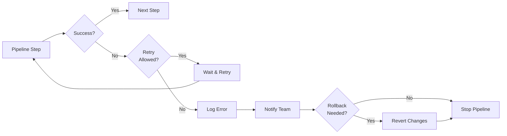

# iOS CI/CD Pipeline - Visual Flowchart

## Mermaid Flowchart Diagram

```mermaid
flowchart TD
    Start([Developer Commits Code]) --> Push[Git Push to GitHub]
    Push --> Trigger{Trigger GitHub Actions}
    
    %% Phase 2: Security & Quality
    Trigger --> Checkout[Checkout Code]
    Checkout --> SonarScan[SonarCloud Scan<br/>Code Quality Analysis]
    SonarScan --> SnykScan[Snyk Security Scan<br/>Vulnerability Check]
    SnykScan --> QualityGate{Quality Gate<br/>Pass?}
    QualityGate -->|Fail| NotifyFail[Notify Team & Stop]
    QualityGate -->|Pass| Carthage[Install Carthage]
    
    %% Phase 3: Dependencies
    Carthage --> Bootstrap[Carthage Bootstrap<br/>Install Dependencies]
    Bootstrap --> DepAudit[Dependency Audit]
    
    %% Phase 4: Build
    DepAudit --> XcodeGen[Install XcodeGen]
    XcodeGen --> GenProject[Generate Xcode Project<br/>xcodegen generate]
    GenProject --> BuildUnsigned[Build Unsigned Archive<br/>xcodebuild archive]
    BuildUnsigned --> CreateUnsignedIPA[Create Unsigned IPA<br/>ZIP Payload]
    
    %% Phase 5: Signing
    CreateUnsignedIPA --> SetupKeychain[Setup Keychain<br/>Create Temp Keychain]
    SetupKeychain --> ImportCert[Import Signing Certificate<br/>Decode Base64 .p12]
    ImportCert --> InstallProfile[Install Provisioning Profile<br/>.mobileprovision]
    InstallProfile --> SignIPA[Sign IPA<br/>xcodebuild -exportArchive]
    SignIPA --> VerifySign[Verify Signature<br/>codesign --verify]
    
    %% Phase 6: Appdome
    VerifySign --> UploadAppdome[Upload to Appdome<br/>API Call]
    UploadAppdome --> ApplySecurity[Apply Security Features<br/>RASP, Anti-tampering, etc.]
    ApplySecurity --> AppdomeBuild[Appdome Fuse & Build]
    AppdomeBuild --> DownloadProtected[Download Protected IPA]
    
    %% Phase 7: Firebase
    DownloadProtected --> PrepareNotes[Prepare Release Notes<br/>Extract from Git]
    PrepareNotes --> UploadFirebase[Upload to Firebase<br/>App Distribution]
    UploadFirebase --> NotifyTesters[Notify Tester Groups<br/>QA, Beta, Internal]
    NotifyTesters --> CollectFeedback[Collect Feedback<br/>Crashes, Analytics]
    
    %% Phase 8: App Store
    CollectFeedback --> ApprovalGate{Manual Approval<br/>for Production?}
    ApprovalGate -->|No| WaitApproval[Wait for Approval]
    WaitApproval --> ApprovalGate
    ApprovalGate -->|Yes| BuildAppStore[Build App Store Version<br/>App Store Certificate]
    BuildAppStore --> UploadAppStore[Upload to App Store Connect<br/>altool/Transporter]
    UploadAppStore --> TestFlight{Use TestFlight<br/>Beta?}
    TestFlight -->|Yes| TestFlightDist[TestFlight Distribution<br/>Beta Testing]
    TestFlight -->|No| SubmitReview[Submit for App Review]
    TestFlightDist --> SubmitReview
    SubmitReview --> AppleReview{Apple Review<br/>Approved?}
    AppleReview -->|Rejected| FixIssues[Fix Issues]
    FixIssues --> Start
    AppleReview -->|Approved| ReleaseAppStore[Release to App Store<br/>✅ PRODUCTION LIVE]
    
    ReleaseAppStore --> End([Pipeline Complete])
    NotifyFail --> End
    
    %% Styling
    classDef phaseOne fill:#e1f5ff,stroke:#01579b
    classDef phaseTwo fill:#fff3e0,stroke:#e65100
    classDef phaseThree fill:#f3e5f5,stroke:#4a148c
    classDef phaseFour fill:#e8f5e9,stroke:#1b5e20
    classDef phaseFive fill:#fff9c4,stroke:#f57f17
    classDef phaseSix fill:#fce4ec,stroke:#880e4f
    classDef phaseSeven fill:#e0f2f1,stroke:#004d40
    classDef phaseEight fill:#ede7f6,stroke:#311b92
    classDef decision fill:#ffecb3,stroke:#ff6f00
    classDef endpoint fill:#ffcdd2,stroke:#b71c1c
    
    class Push,Checkout phaseOne
    class SonarScan,SnykScan,QualityGate phaseTwo
    class Carthage,Bootstrap,DepAudit phaseThree
    class XcodeGen,GenProject,BuildUnsigned,CreateUnsignedIPA phaseFour
    class SetupKeychain,ImportCert,InstallProfile,SignIPA,VerifySign phaseFive
    class UploadAppdome,ApplySecurity,AppdomeBuild,DownloadProtected phaseSix
    class PrepareNotes,UploadFirebase,NotifyTesters,CollectFeedback phaseSeven
    class BuildAppStore,UploadAppStore,TestFlightDist,SubmitReview,ReleaseAppStore phaseEight
    class QualityGate,ApprovalGate,TestFlight,AppleReview decision
    class Start,End,NotifyFail endpoint
```



## Swimlane Diagram (By Phase)

```mermaid
graph TB
    subgraph "Phase 1: Source Control"
        A1[Developer Push] --> A2[GitHub Trigger]
    end
    
    subgraph "Phase 2: Quality & Security"
        A2 --> B1[SonarCloud]
        B1 --> B2[Snyk Scan]
        B2 --> B3{Quality Gate}
    end
    
    subgraph "Phase 3: Dependencies"
        B3 --> C1[Carthage Install]
        C1 --> C2[Bootstrap Deps]
    end
    
    subgraph "Phase 4: Build"
        C2 --> D1[XcodeGen]
        D1 --> D2[Build Archive]
        D2 --> D3[Create Unsigned IPA]
    end
    
    subgraph "Phase 5: Code Signing"
        D3 --> E1[Setup Keychain]
        E1 --> E2[Import Certificate]
        E2 --> E3[Sign IPA]
    end
    
    subgraph "Phase 6: Appdome Security"
        E3 --> F1[Upload to Appdome]
        F1 --> F2[Apply Security]
        F2 --> F3[Download Protected IPA]
    end
    
    subgraph "Phase 7: Firebase Testing"
        F3 --> G1[Upload to Firebase]
        G1 --> G2[Notify Testers]
        G2 --> G3[Collect Feedback]
    end
    
    subgraph "Phase 8: App Store Production"
        G3 --> H1{Approval}
        H1 --> H2[Build App Store]
        H2 --> H3[Upload]
        H3 --> H4[TestFlight]
        H4 --> H5[Submit Review]
        H5 --> H6[🎉 Released]
    end
```



## Timeline View

```
Time ──────────────────────────────────────────────────────────────────>

0min    ├─ Code Push
        │
2min    ├─ Checkout & Scans Start
        │  ├─ SonarCloud (3-5 min)
        │  └─ Snyk (2-3 min)
        │
7min    ├─ Dependencies
        │  └─ Carthage Bootstrap (3-5 min)
        │
12min   ├─ Build Phase
        │  ├─ XcodeGen (30 sec)
        │  ├─ xcodebuild (5-8 min)
        │  └─ Create IPA (1 min)
        │
20min   ├─ Code Signing
        │  └─ Sign & Verify (2-3 min)
        │
23min   ├─ Appdome Integration
        │  └─ Security Hardening (5-10 min)
        │
33min   ├─ Firebase Distribution
        │  └─ Upload & Notify (2-3 min)
        │
36min   ├─ Manual Approval Gate
        │  └─ (Variable - hours/days)
        │
        ├─ App Store Upload
        │  ├─ Build (8-10 min)
        │  ├─ Upload (3-5 min)
        │  ├─ Apple Processing (10-30 min)
        │  └─ Review (1-3 days typically)
        │
        └─ 🎉 Production Release

Total Automated Time: ~36 minutes (before manual approval)
Total with App Store: ~2-4 days (including review)
```

## Parallel Processing Diagram

```
                    Checkout Code
                         │
        ┌────────────────┼────────────────┐
        │                │                │
        ▼                ▼                ▼
   SonarCloud         Snyk            Lint/Format
     Scan             Scan             Checks
        │                │                │
        └────────────────┼────────────────┘
                         │
                  Quality Gate ✓
                         │
                    Continue Pipeline
```

## Error Handling Flow



## Legend

### Phase Colors
- 🔵 **Blue** - Source Control
- 🟠 **Orange** - Quality & Security  
- 🟣 **Purple** - Dependencies
- 🟢 **Green** - Build
- 🟡 **Yellow** - Code Signing
- 🔴 **Pink** - Appdome Security
- 🔷 **Teal** - Firebase Testing
- 🟣 **Violet** - App Store Production

### Symbols
- `⬜ Rectangle` - Process/Action
- `◇ Diamond` - Decision Point
- `⬭ Rounded` - Start/End Point
- `→ Arrow` - Flow Direction

---

**Render this diagram** in any Mermaid-compatible viewer:
- GitHub (natively supported)
- VS Code (with Mermaid extension)
- [Mermaid Live Editor](https://mermaid.live/)
- GitLab
- Confluence
