# Requestify Sequence Diagrams

This document contains detailed sequence diagrams for various Requestify operations and workflows.

## Table of Contents
1. [Standard Request Flow](#1-standard-request-flow)
2. [Multipart Upload Flow](#2-multipart-upload-flow)
3. [Error Handling Flow](#3-error-handling-flow)
4. [CI/CD Pipeline Flow](#4-cicd-pipeline-flow)
5. [Code Signing Flow](#5-code-signing-flow)

---

## 1. Standard Request Flow

### GET Request with Logging

### POST Request with Parameters

---

## 2. Multipart Upload Flow

### Image Upload with Metadata

---

## 3. Error Handling Flow

### Complete Error Handling Sequence

### Error Recovery Pattern

---

## 4. CI/CD Pipeline Flow

### Complete GitHub Actions Workflow

```mermaid
sequenceDiagram
    participant Dev as Developer
    participant Git as GitHub
    participant GHA as GitHub Actions
    participant SPM as Swift PM
    participant XCG as XcodeGen
    participant XCB as xcodebuild
    participant Sign as Code Signing
    participant Art as Artifacts

    Dev->>Git: git push origin main
    Git->>GHA: Trigger workflow
    
    GHA->>GHA: Checkout repository
    GHA->>SPM: swift package resolve
    SPM-->>GHA: Dependencies resolved
    
    GHA->>SPM: swift build -v
    SPM->>SPM: Compile sources
    SPM-->>GHA: Build successful
    
    GHA->>SPM: swift test --enable-code-coverage
    SPM->>SPM: Run unit tests
    SPM-->>GHA: Tests passed ✓
    
    GHA->>XCG: brew install xcodegen
    XCG-->>GHA: Installed
    
    GHA->>XCG: xcodegen generate
    XCG->>XCG: Parse project.yml
    XCG->>XCG: Generate .xcodeproj
    XCG-->>GHA: Project created
    
    alt Secrets configured
        GHA->>Sign: Setup code signing
        Sign->>Sign: Create keychain
        Sign->>Sign: Import certificate
        Sign->>Sign: Install provisioning profile
        Sign-->>GHA: Signing ready
        
        GHA->>XCB: xcodebuild archive (signed)
        XCB->>XCB: Build app with signing
        XCB-->>GHA: Archive created
        
        GHA->>XCB: xcodebuild -exportArchive
        XCB->>XCB: Export signed IPA
        XCB-->>GHA: IPA file created
    else No secrets
        GHA->>XCB: xcodebuild archive (unsigned)
        XCB->>XCB: Build app without signing
        XCB-->>GHA: Archive created
        
        GHA->>GHA: Fallback ZIP packaging
        GHA->>GHA: Create Payload/ folder
        GHA->>GHA: Copy .app to Payload/
        GHA->>GHA: ZIP as .ipa
        GHA-->>GHA: Unsigned IPA created
    end
    
    GHA->>Art: Upload IPA artifact
    Art-->>GHA: Upload complete
    
    alt Export failed
        GHA->>Art: Upload export logs
        Art-->>GHA: Logs uploaded
    end
    
    GHA-->>Git: Workflow completed ✓
    Git-->>Dev: Notification
    
    Dev->>Git: Download artifacts
    Git-->>Dev: IPA file
```

---

## 5. Code Signing Flow

### Development Certificate Setup

---

## 6. Parameter Building Flow

### Complex Parameter Construction

---

## 7. Logging Flow

### Request/Response Logging Sequence

```mermaid
sequenceDiagram
    participant App as Application
    participant Req as Requestify
    participant Log as printApiLog
    participant AF as Alamofire
    participant Con as Console

    App->>Req: setPrintLog(true)
    App->>Req: setPrintResponse(true)
    App->>Req: await request(User.self)
    
    Req->>Log: logRequest(url, method, headers, params)
    Log->>Con: Print "🌐 REQUEST:"
    Log->>Con: Print "URL: https://..."
    Log->>Con: Print "Method: POST"
    Log->>Con: Print "Headers: {...}"
    Log->>Con: Print "Parameters: {...}"
    Con-->>App: Console output
    
    Req->>AF: Send request
    AF->>AF: Execute HTTP call
    
    AF-->>Req: Response received
    
    Req->>Log: logResponse(statusCode, data, error)
    Log->>Con: Print "📥 RESPONSE:"
    Log->>Con: Print "Status: 200"
    Log->>Con: Print "Data: {...}"
    Con-->>App: Console output
    
    Req-->>App: Return parsed object
```

---

## Legend

### Sequence Diagram Symbols

- **Solid Arrow (→)**: Synchronous call
- **Dashed Arrow (- -)**: Return value
- **Note box**: Additional information
- **Alt box**: Alternative/conditional flow
- **Loop box**: Repeated operations
- **Participant**: System component or actor

### Common Abbreviations

- **App**: Application (consumer of Requestify)
- **Req**: Requestify library
- **AF**: Alamofire framework
- **API**: Remote API server
- **GHA**: GitHub Actions
- **XCB**: xcodebuild tool
- **SPM**: Swift Package Manager
- **KC**: macOS Keychain

---

**Document Version**: 1.0  
**Last Updated**: November 2025  
**Maintained By**: Requestify Team
